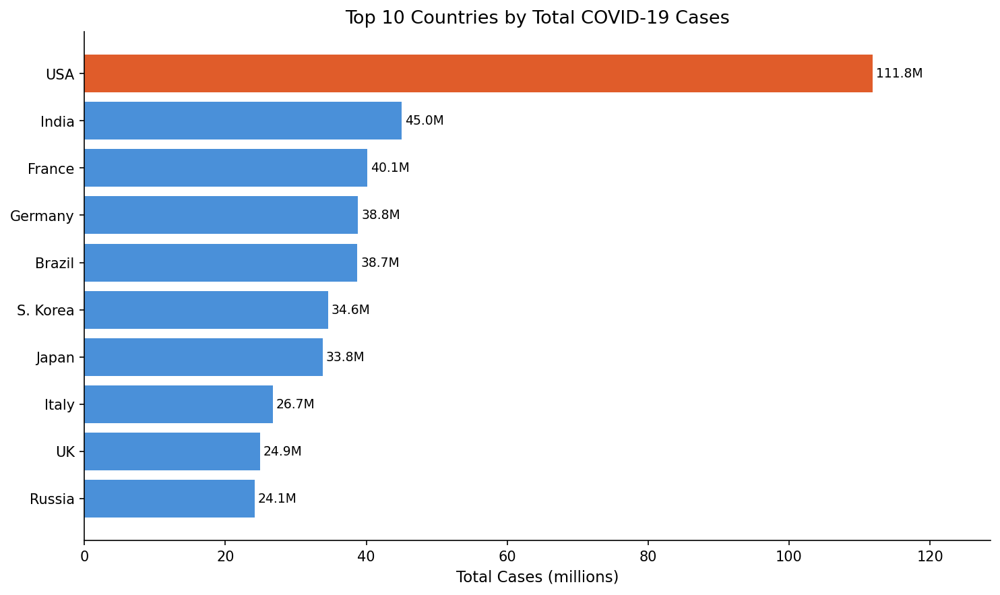
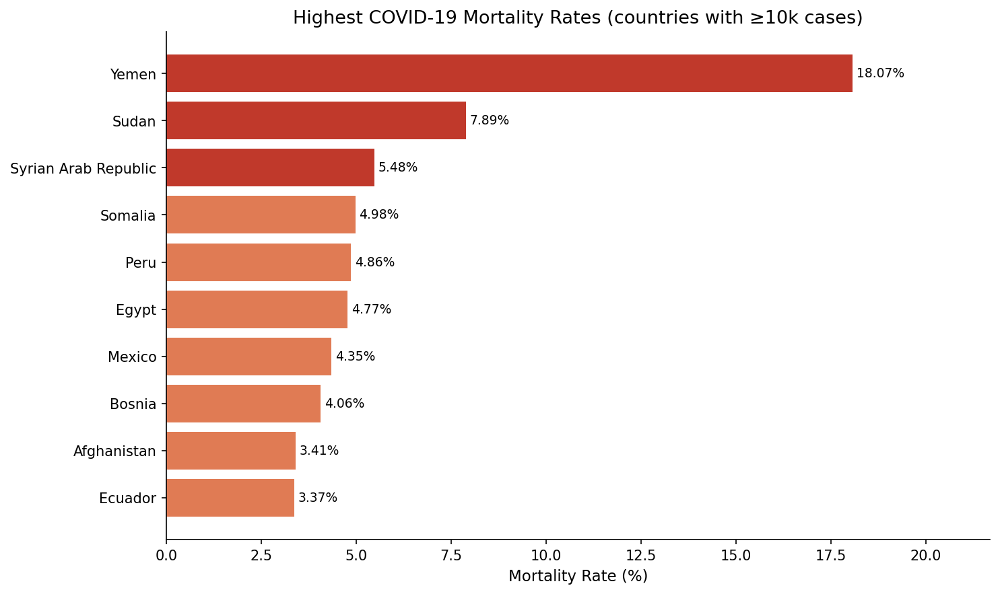
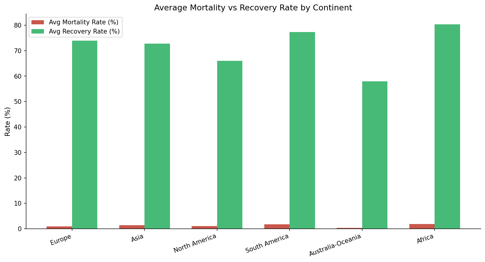
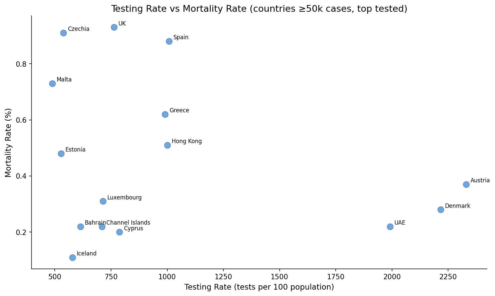
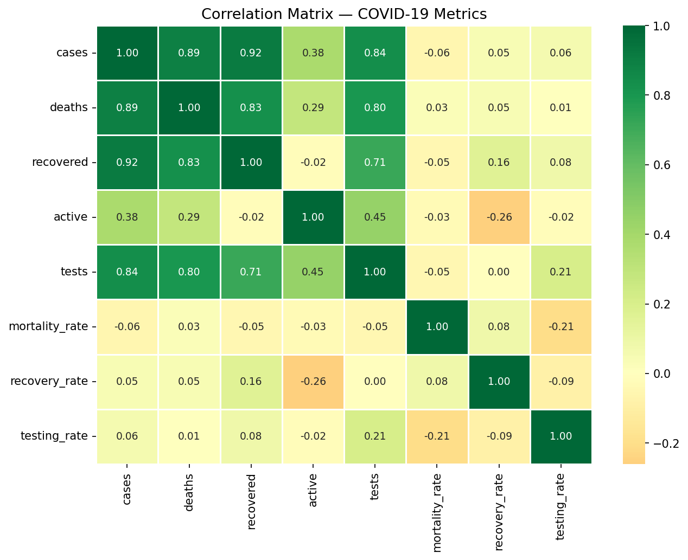

# COVID-19 API Data Pipeline

An end-to-end ETL pipeline that fetches live COVID-19 data from a public API, transforms it with Pandas, stores it in SQLite, and surfaces insights through analytical SQL queries and visualisations.

---

## Tech Stack
Python · Pandas · SQLite · Matplotlib · Seaborn · Requests · disease.sh API

---

## Pipeline Architecture
disease.sh API → requests.get() → Pandas (transform) → SQLite → SQL queries → Visualisations

---

## Key Findings

- **USA leads globally** with 111.8M cases, but a relatively low mortality rate of 1.09%
- **Yemen** has the highest mortality rate at 18.07% among countries with ≥10k cases — likely reflecting limited healthcare infrastructure and underreporting
- **Africa** has the highest average mortality rate (1.91%) continent-wide despite the lowest total case count, suggesting systemic underdetection
- **South America** shows the highest avg mortality (1.77%) with Brazil at 1.84%
- **High testing ↔ low mortality**: Austria (2330% testing rate, 0.37% mortality), Denmark (2216%, 0.28%), UAE (1991%, 0.22%) — consistent negative correlation
- **Singapore and S. Korea** achieve near-perfect recovery rates (99.9%+) with large case volumes

---

## Visualisations

### Top 10 Countries by Cases

### Mortality Rate by Country (≥10k cases)

### Continental Mortality vs Recovery Rates

### Testing Rate vs Mortality Rate

### Correlation Heatmap

---

## SQL Queries Covered
- Top 10 countries by total cases
- Highest mortality rates (filtered ≥10k cases)
- Continental aggregation (cases, deaths, tests, avg rates)
- Testing rate vs mortality analysis
- Critical case burden by country

---

## Data Source
[disease.sh — Open Disease Data](https://disease.sh/) · Snapshot: 2025
